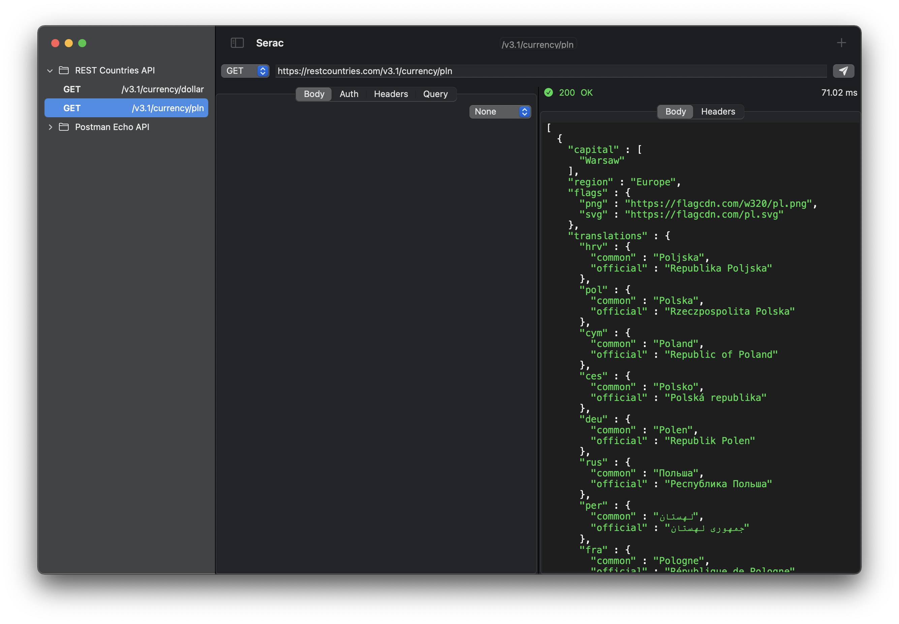

# Serac

A lightweight REST client for macOS.

## About

The goal of this project is to build a simple, native client suitable for
consuming JSON-based REST APIs. It has a very focused objective: support the minimal
feature set required for working with HTTP API endpoints that communicate using JSON
requests and responses.

## Developing

You'll need at least macOS 11.x and Xcode 12.x or newer.

There are currently no other third-party dependencies required. You can open the project
in Xcode and build it right away!

## Contributing

All contributions are welcome! Feel free to open a pull request if there is something you'd 
like to pitch in for the project.
